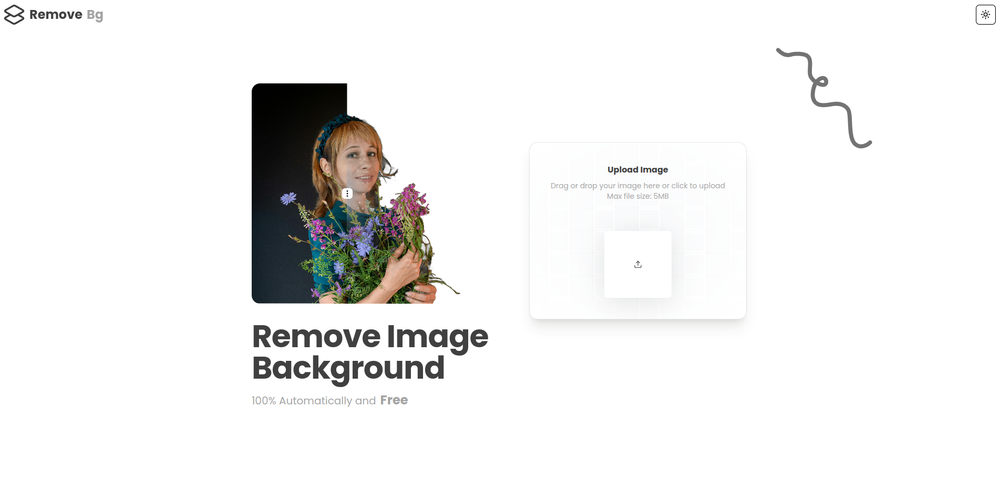
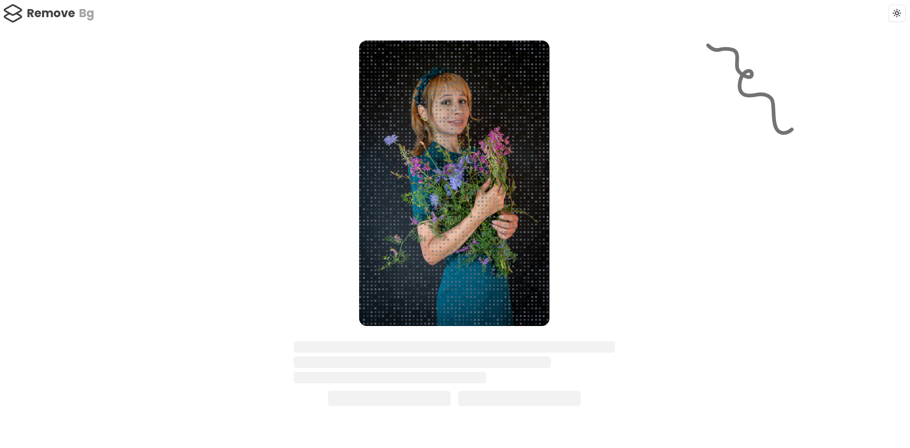
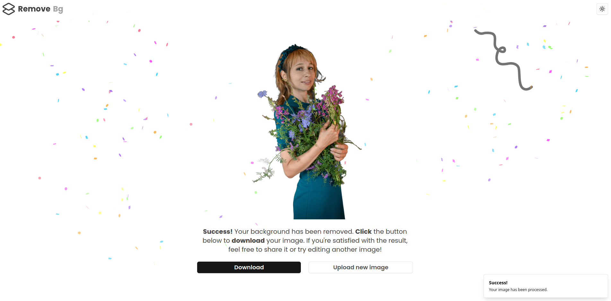
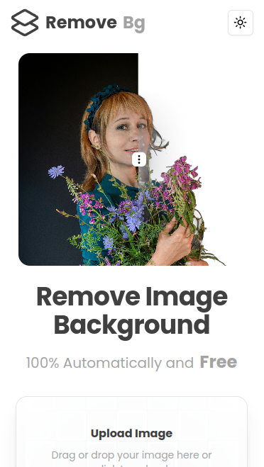
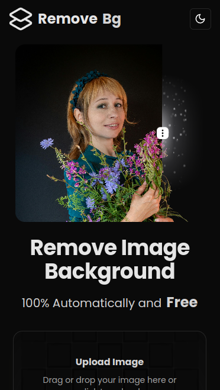

# Remove-Bg

- **remove-bg** is a full-stack application designed to remove backgrounds from images. It features a **Node.js** and **Express** server that provides an image processing API, leveraging the **@imgly/background-removal-node** library for background removal. On the frontend, a **React-based** client delivers an updated **UI/UX**, allowing seamless interaction with the server for a smooth and user-friendly experience.
- Demo: https://demo10.isaccobertoli.com/


## Tech Stack Client

- React
- Axios
- Tailwind
- Typescript
- Shadcn UI
- Magic UI
- Aceternity UI


## Tech Stack Server

- Node
- Express
- Imgly/background-removal-node
- Multer
- Cors


## Client Images

<div>
    
    
    
</div>

<div>
    
    
</div>


## Getting Up and Running Locally

### Clone Repo

```bash
git clone https://github.com/Isacco-B/bg-remover
```
### Client

```bash
cd client
```

- Create .env file with the following variables:

```bash
VITE_HOST=server url

```

- Install dependencies

```bash
npm install
```

- Start server

```bash
npm run dev
```

### Server

```bash
cd server
```

- Create .env file with the following variables:

```bash
NODE_ENV=development|production
PORT=3000
HOST=client url
ALLOWD_HOSTS=host1,host2,host3

```

- Install dependencies

```bash
npm install
```

- Start server

```bash
npm run dev
```

## 🔗 Links

[](https://www.linkedin.com/in/isacco-bertoli-10aa16252/)
